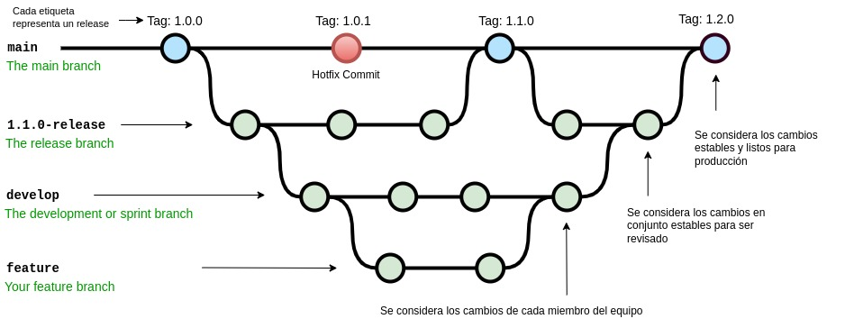

# Backend side para C6-28-T - MUNDO MASCOTAS

## Descripción

C6-28-BACKEND es un repositorio para alojar el Back End del E-commerce "Mundo Mascotas", desarrollado como proyecto para el Cohorte 6 de No Country. Aqui encontraras la conexión a la base de datos, el modelado y el código fuente referido al manejo de errores, seguridad y endpoints.

## Uso del proyecto

TODO

## Git Flow

## Modelado de la Base de Datos

## Tecnologías utilizadas

- Java Script
- Sequelize
- PostgreSQL
- TODO

## Documentación

https://c6-28.up.railway.app/

## Integrantes

- James Noria
- Carolina Quintoman
- Mikel Diaz
- Kevin Huaza Navia
- Ariel Cuello
